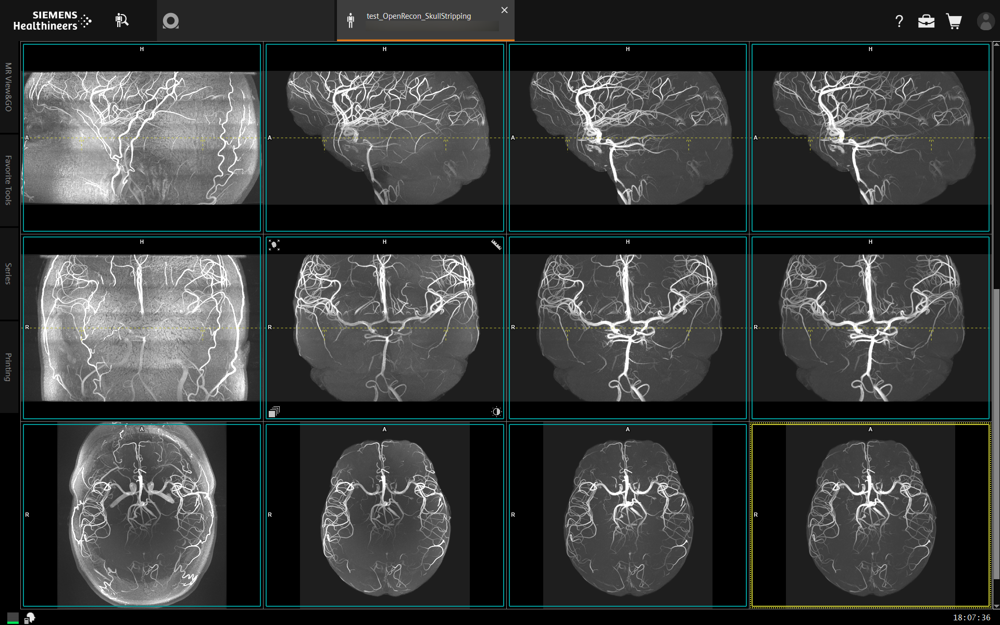

# openrecon-ants

## Screenshots from the MR Host
Siemens 7T Terra.X in XA60A.  
Also tested on Siemens 3T Cima.X on XA61(-SP01)  


## Brainmasking, Debias, Denoise
  
_Sequence_: Non-selective 3D SPACE.  
_From left to right_: Original, brain mask (SynthStrip), N4BiasFieldCorrection (ANTs) in brain mask, DenoiseImage (ANTs) in brain mask after N4BiasFieldCorrection.  
_From top to bottom_: 3D FLAIR with Circular Polarization (CP), 3D FLAIR with Universal Pulses (UP), 3D DIR with UP.  

[ANTs](https://github.com/ANTsX/ANTs) using [ANTsPy](https://github.com/ANTsX/ANTsPy) in OpenRecon.  
Brain masking is performed by [SynthStrip](https://surfer.nmr.mgh.harvard.edu/docs/synthstrip/)


## SkullStripping


_Sequence_: Angio TOF  
_From left to right_: Original, SkullStripped using brainmask from Synthstrip, N4BiasFieldCorrection, DenoiseImage  
_From top to bottom_: SAG MIP, COR MIP, TRA MIP


# Features

This OR performs ANTs image operations : 
- N4BiasFieldCorrection
- DenoiseImage
- N4BiasFieldCorrection then DenoiseImage (default)
- DenoiseImage then N4BiasFieldCorrection
- None (only for brain masking / skull stripping)

Brain mask usage :
- Apply ANTs in brainmask (keep outside the mask intact)
- Skull stripping then ANTs (keep only in mask)
- None (only ANTs, no masking)

There is an option, a checkbox, to **save original images** and intermediate images. (default is _True_)

Based on https://github.com/benoitberanger/openrecon-template


# Build

Requirements for building :
- python **3.12**
- jsonschema

 Python environment manager is **strongly** recomanded :
```bash
conda create --name openrecon-ants
conda install python=3.12
pip install jsonschema
```

Build with :
```bash
python build.py
```


# Offline test and dev

Python modules :
- ismrmrd
- pydicom
- pynetdicom
- antspyx
- torch
- surfa

``` bash
pip install ismrmrd pydicom pynetdicom antspyx torch surfa
```
Follow guidelines in https://github.com/benoitberanger/openrecon-template

# TODO

- Add fields in the UI to tune `N4BiasFieldCorrection` and `DenoiseImage`
- Add fields in the UI to tune the mask (erode ? delate ? ...)

